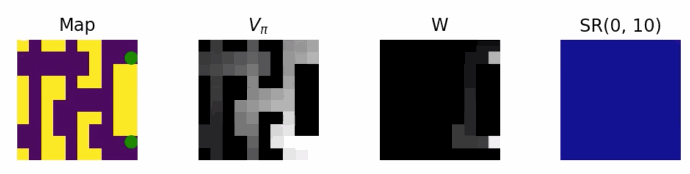

# SR-Dyna Python Implementation

A Python/numpy implementation of SR-Dyna from [1] by Russek, Momennejad, Botvinick, Gershman and Daw, 2017.

Russek's [Matlab code](https://github.com/evanrussek/Predictive-Representations-PLOS-CB-2017/blob/master/agents/model_SRDYNA.m) and Momennejad's [Python tutorials](https://github.com/idamomen/predictive_representations) were used for reference to fill in gaps when not fully specified.

## Usage

Install requirements `pip install -r requirements.txt`, then run one of the task jupyter notebooks `jupyter notebook ./sr-dyna-latent-learning.ipynb`. Output animations are saved to `./out`.

Main gridworld and algorithm code is in `srdyna.py`. Each notebook runs simulations attempted to match experiments presented in [1].

## References

1. Russek, E. M., Momennejad, I., Botvinick, M. M., Gershman, S. J., & Daw, N. D. (2017). [Predictive representations can link model-based reinforcement learning to model-free mechanisms](https://journals.plos.org/ploscompbiol/article?id=10.1371/journal.pcbi.1005768). PLoS computational biology, 13(9), e1005768.